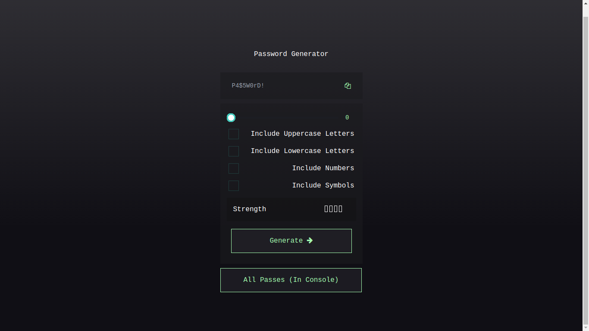
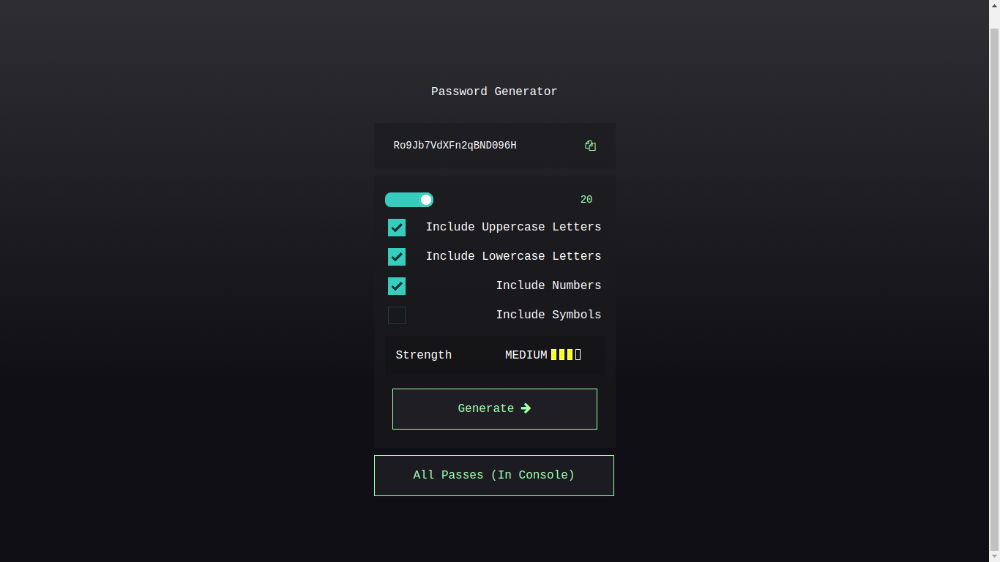
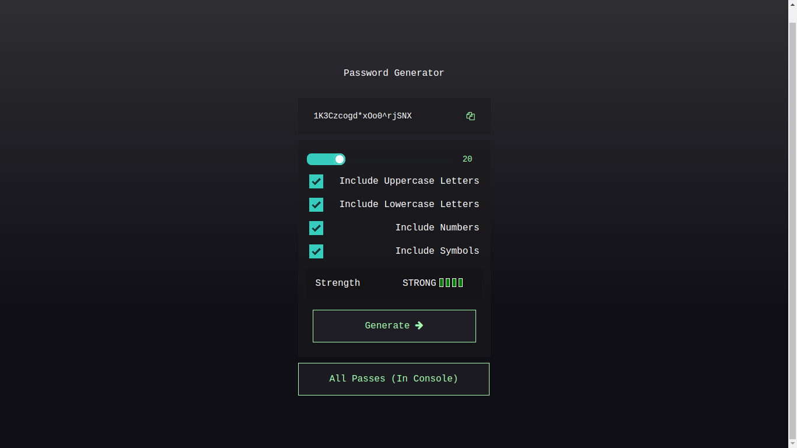
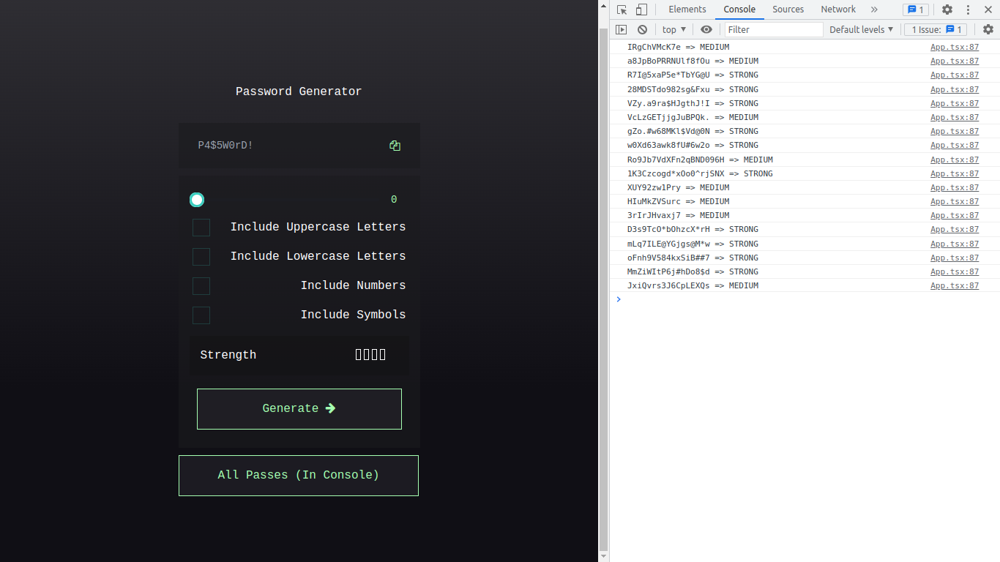

# Password Generator Project

## Overview

This is a project forr generating random passwords. It has a strength check and a way for viewing previously generated passwords in the console.

Try it out.

## Used tools

- SolidJS
- Typescript
- PouchDB

## Setting up the Project

- Install dependencies

```
$ npm install
```

- Run the project

```
$ npm run dev
```

- Open project with browser

## Screenshots

<div>
    
    
    
    
</div>
